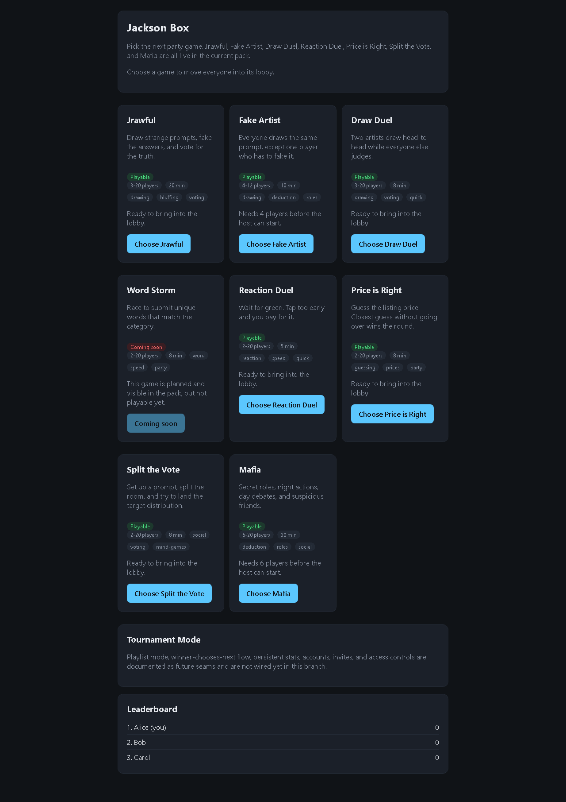

# jacksonbox

Jackson Box is a realtime party-game pack built on a Go single-writer room actor and a Vite/React/TypeScript client. It currently includes playable Jrawful, Draw Duel, Fake Artist, Mafia, Price is Right, Reaction Duel, and Split the Vote modes for invite-only rooms of up to 20 players.

Full architecture lives in [docs/DESIGN.md](docs/DESIGN.md).

## Demo



Playable game demos:
[Jrawful](docs/jrawful-gameplay.gif),
[Draw Duel](docs/draw-duel-gameplay.gif),
[Fake Artist](docs/fake-artist-gameplay.gif),
[Mafia](docs/mafia-gameplay.gif),
[Price is Right](docs/price-is-right-gameplay.gif),
[Reaction Duel](docs/reaction-duel-gameplay.gif),
[Split the Vote](docs/split-vote-gameplay.gif).

Mafia role-perspective demos and instructions live in [docs/mafia-roles.md](docs/mafia-roles.md):
[citizen](docs/mafia-citizen.gif),
[mafia](docs/mafia-mafia.gif),
[detective](docs/mafia-detective.gif),
[doctor](docs/mafia-doctor.gif),
[mayor](docs/mafia-mayor.gif).

## Highlights

- Actor-model room engine keeps all game state mutations single-threaded.
- Typed wire protocol is mirrored between Go and TypeScript to catch drift early.
- Integration tests exercise real room actors and gateway connections.
- Playwright E2E runs full round-trip gameplay over real WebSockets.
- Gameplay GIFs are generated from real E2E screenshots.

## Quick Start

### Backend

```bash
go test ./cmd/... ./internal/...
go run ./cmd/server
```

The backend defaults to `:8787`.

### Client

```bash
cd client
npm install
npm run dev
```

The Vite client defaults to `:4273` and proxies `/ws` to the backend.

Open two or more browser tabs on the dev server, join the same room with different names, choose a game, ready up, and play. No Docker and no persistence are required.

## Testing

### Backend

```bash
go test ./...
```

Package-level examples:

```bash
go test ./internal/games/drawful
go test ./internal/games/mafia
go test ./internal/room
```

### Client

```bash
cd client
npm run typecheck
npm test
npm run e2e
```

The E2E config starts the Go backend and Vite dev server, then drives real browser contexts over real WebSockets.

Current Playwright specs include:

| Spec | Coverage |
|---|---|
| `e2e/full-round.spec.ts` | Jrawful full round and platform flow. |
| `e2e/draw-duel.spec.ts` | Draw Duel picker, lobby, draw, vote, reveal, results, and GIF shots. |
| `e2e/fake-artist.spec.ts` | Fake Artist 10-player turns, countdowns, replay, voting, guessing, results, and GIF shots. |
| `e2e/mafia.spec.ts` | Mafia role assignment, night actions, nominations, voting, reveal, and results. |
| `e2e/mafia-role-gifs.spec.ts` | Role-perspective GIF frames for Citizen, Mafia, Detective, Doctor, and Mayor. |
| `e2e/price-is-right.spec.ts` | Product image loading, guessing, closest-without-going-over reveal, results, and GIF shots. |
| `e2e/reaction-duel.spec.ts` | Countdown, green-light tap, reaction times, results, and GIF shots. |
| `e2e/split-vote.spec.ts` | Splitter-only target/options, non-splitter voting, reveal, and GIF shots. |

## Gameplay GIFs

Capture fresh frames with the relevant Playwright spec, then rebuild GIFs:

```bash
cd client
npm run e2e
npm run build:demo-gifs
```

`npm run build:demo-gifs` reads `docs/demo-shots/*.png` and overwrites the GIFs in `docs/`.

## Current Limitations

- Single room only.
- In-memory state only; restarting the server resets rooms and sessions.
- Accounts, auth, profile pictures, invite revocation, access revocation, persistent stats, head-to-head records, playlist mode, and tournament mode are documented/scaffolded as future seams only.
- No spectator mode yet.
- Metrics/dashboarding not shipped.
- PNG drawing format and submit progress events are still backlog items.
