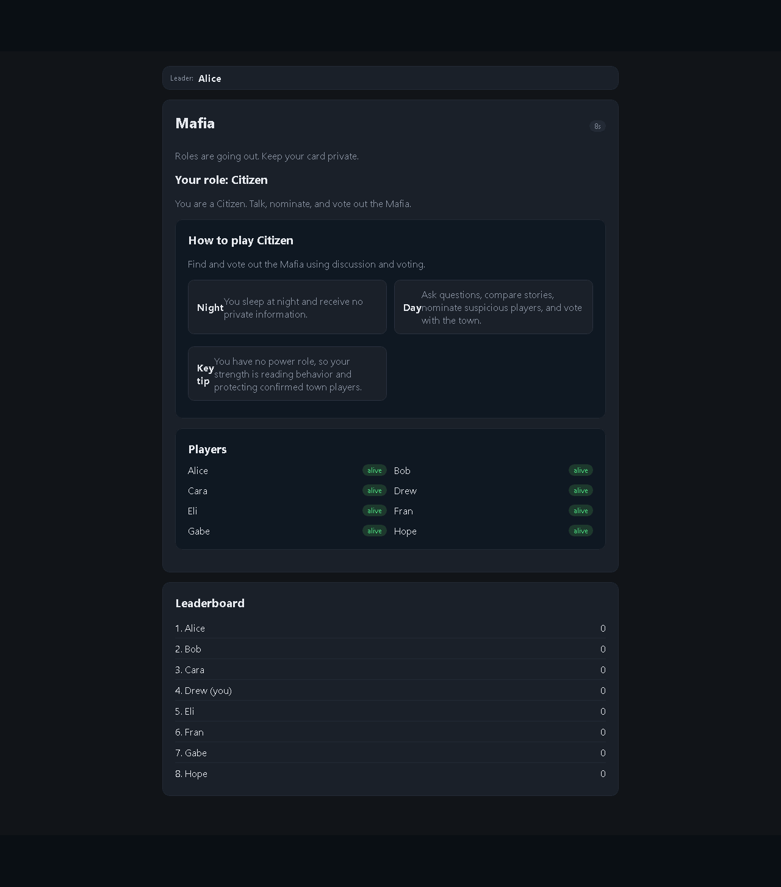
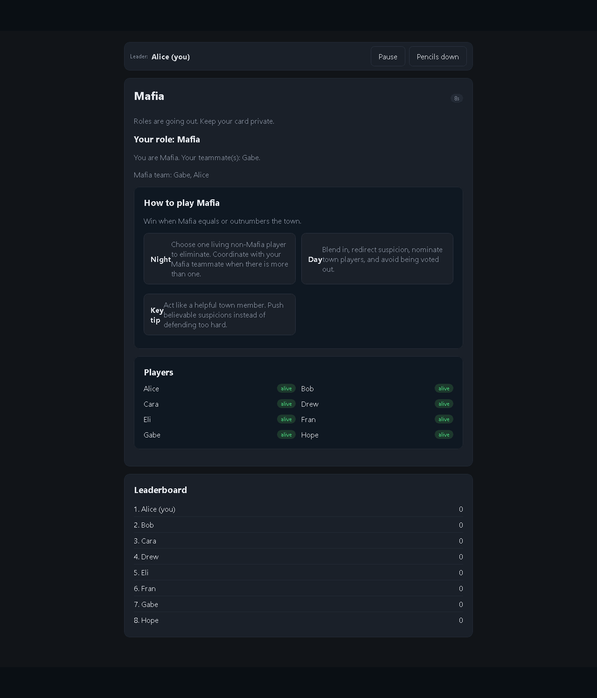
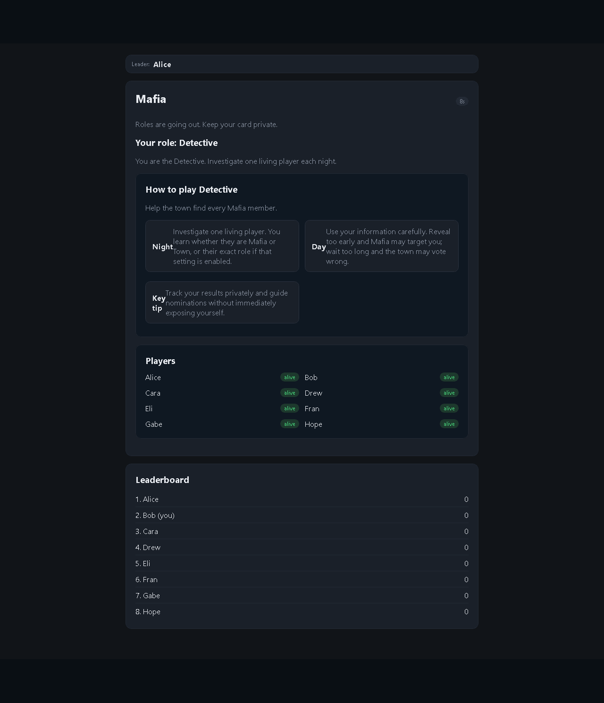
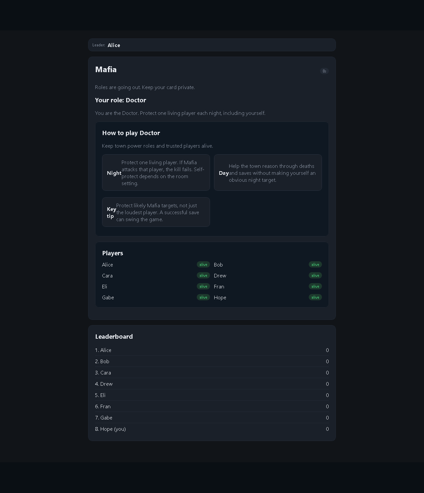
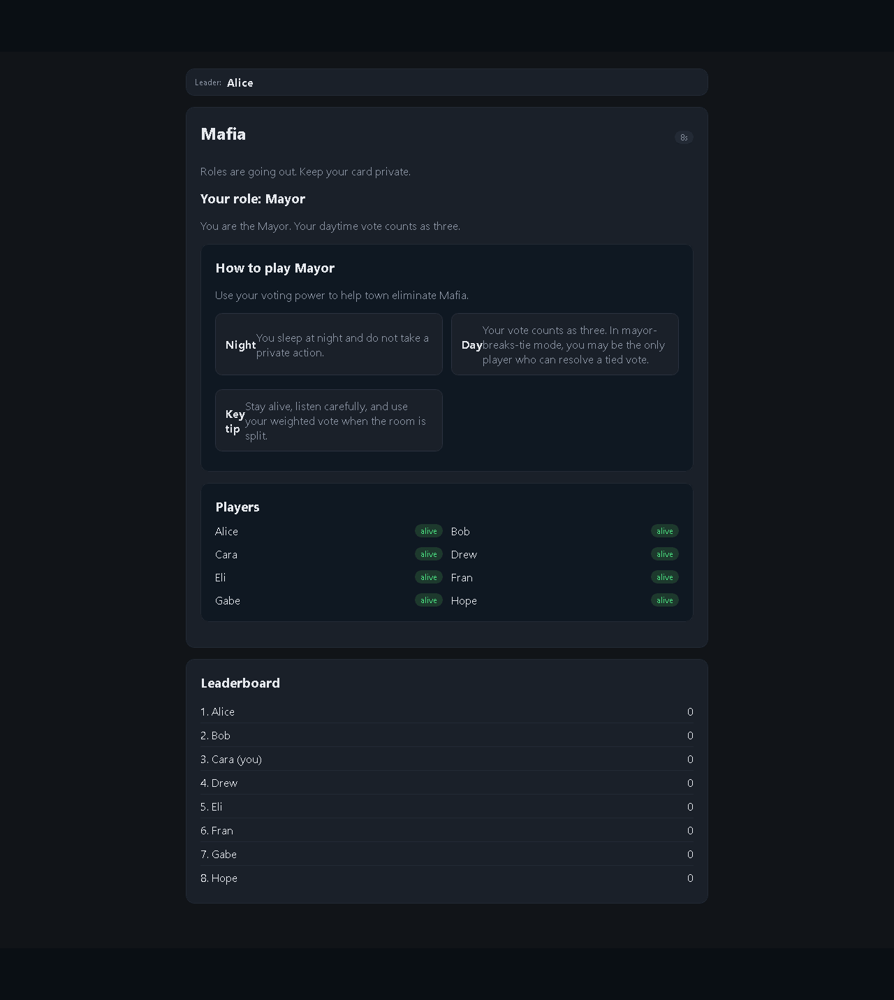

# Mafia Role Guide

Mafia is a hidden-role game where the town tries to identify every Mafia player before the Mafia equals or outnumbers the town. Roles are private unless the room settings reveal roles on death.

## Citizen

Citizens have no night action. Your job is to listen, question suspicious stories, nominate likely Mafia players, and vote with the town. Since you do not receive private information, your power comes from discussion and reading behavior.

## Mafia

Mafia players know their teammates. At night, choose a living non-Mafia player to eliminate. During the day, blend in with the town, redirect suspicion, and avoid being nominated or voted out. Mafia wins when Mafia equals or outnumbers the town.

## Detective

The Detective investigates one living player each night. Depending on room settings, you learn whether that player is Mafia or Town, or their exact role. During the day, use your information carefully: revealing too early can make you a night target, but waiting too long can let the town vote wrong.

## Doctor

The Doctor protects one living player each night. If Mafia attacks the protected player, the kill fails. Self-protection depends on the room setting. During the day, help the town reason through deaths and saves without making yourself too obvious.

## Mayor

The Mayor has no night action, but the Mayor's day vote counts as three. In mayor-breaks-tie mode, the Mayor can be the deciding vote on tied eliminations. Stay alive, listen carefully, and use the weighted vote when the town is split.
